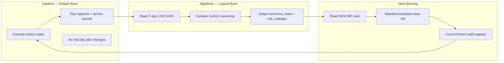
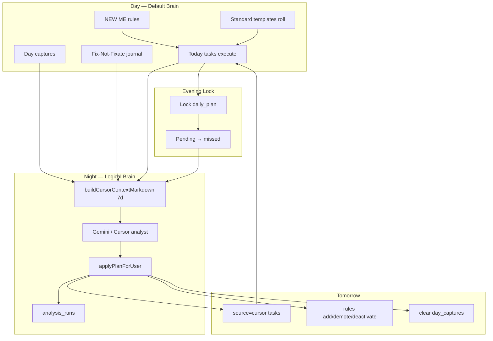
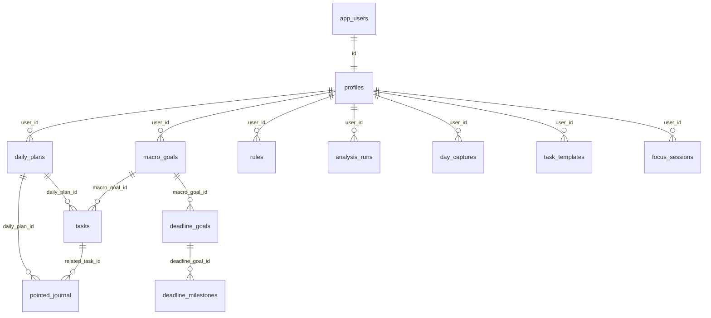

# plusUltra — Complete System Documentation

> **Slave to the logical brain.**  
> Single-user personal operating system implementing the **Attack Mode** behavioral framework: daily execution, CBT journaling, AI-driven plan mutation, and system-health metrics — not streaks, not blame, not vibes.

This document describes how the app works end-to-end: philosophy, features, data model, AI pipeline, stats, auditing, and how plans adapt over time. It reflects the **current codebase** (Next.js 14 + Supabase + Gemini API + Vercel cron), not the original v1 README which described Cursor-only copy/paste.

---

## Table of Contents

1. [What plusUltra Is](#1-what-plusultra-is)
2. [Attack Mode — Philosophy & Principles](#2-attack-mode--philosophy--principles)
3. [The Two Brains Model](#3-the-two-brains-model)
4. [Identity System — Macro Pillars](#4-identity-system--macro-pillars)
5. [Execution Rate & System Stats](#5-execution-rate--system-stats)
6. [Pointed Journaling (CBT)](#6-pointed-journaling-cbt)
7. [NEW ME Rules](#7-new-me-rules)
8. [Deadlines (V.IMP)](#8-deadlines-vimp)
9. [The Daily Loop](#9-the-daily-loop)
10. [Tasks System](#10-tasks-system)
11. [Plan Generation & Daily Mutation](#11-plan-generation--daily-mutation)
12. [Phase Context — How the AI Understands You](#12-phase-context--how-the-ai-understands-you)
13. [AI Integrations](#13-ai-integrations)
14. [Nightly Analysis Pipeline](#14-nightly-analysis-pipeline)
15. [Day Captures](#15-day-captures)
16. [Insights & Auditing](#16-insights--auditing)
17. [Work Context (Verizon / Freelance)](#17-work-context-verizon--freelance)
18. [Focus Sessions](#18-focus-sessions)
19. [App Routes & Features](#19-app-routes--features)
20. [Database Schema & Migrations](#20-database-schema--migrations)
21. [Architectural Commitments](#21-architectural-commitments)
22. [Configuration & Environment](#22-configuration--environment)
23. [Evolution — v1 to Current](#23-evolution--v1-to-current)
24. [Key File Reference](#24-key-file-reference)

---

## 1. What plusUltra Is

plusUltra is a **personal productivity + introspection app** that runs a behavioral framework called **Attack Mode** as executable software. It is not a generic todo app. It is a closed loop:

```
Morning  → read NEW ME rules, execute today's plan (default brain)
Day      → mark tasks done, log triggers, dump captures
Evening  → lock the day, journal every miss (Fix-Not-Fixate)
Night    → logical brain reads 7 days of evidence, mutates tomorrow
Tomorrow → new AI tasks + standard templates + repair tasks appear
```

### Design goals

| Goal | How the app enforces it |
|------|-------------------------|
| **System over willpower** | Plans mutate from data; recurring misses trigger structural changes |
| **Repair not blame** | Missed tasks open CBT journal, not shame UI |
| **Performance over output** | Success = execution rate, not outcomes or self-worth |
| **Anti-summarization drift** | Raw journal immutable; AI output stored verbatim in `analysis_runs` |
| **No streaks** | 14-day rolling execution rate framed as system health |
| **One logical brain per day** | One analysis apply per calendar day |

### Stack

| Layer | Technology |
|-------|------------|
| UI | Next.js 14 (App Router) + Tailwind |
| Database | Supabase PostgreSQL |
| Auth | Username + password, encrypted session cookie |
| Server data access | Supabase service role, filtered by `user_id` |
| AI (primary) | Google Gemini API (`@google/generative-ai`) |
| AI (fallback) | Cursor / ChatGPT copy-paste bridge at `/cursor` |
| Scheduling | Vercel cron → `/api/cron/nightly` |
| Hosting | Vercel |

---

## 2. Attack Mode — Philosophy & Principles

Attack Mode exists in two layers inside plusUltra:

1. **Content layer** — browsable reference library at `/attack-mode` (Modules 1, 2, 5 + Section 5 System)
2. **Runtime layer** — distilled into `src/lib/analyst-framework.ts` and injected into every nightly AI analysis

There is **no `attack_mode` database table**. The framework is philosophy encoded as content + prompts + behavior.

### 2.1 Core principles (non-negotiable)

These are enforced in analyst prompts and reflected in UI copy:

| Principle | Meaning in practice |
|-----------|---------------------|
| **Slave to logical brain** | At night, logic designs tomorrow's schedule. During the day, default brain executes — no mid-day renegotiation |
| **Repair not blame · Fix not fixate** | On failure: acknowledge damage → one bounded repair → move on. No guilt loops, no streak shame |
| **Performance over output** | Judge **execution rate** (done vs missed), not self-worth or visible results |
| **Kaam karo, phal ki chinta mat karo** | Execute today's system; results are downstream lagging indicators |
| **System over willpower** | Small repeatable daily blocks beat heroic sessions. Plans **mutate daily** from data |
| **Deadlines are God (V.IMP)** | Rank work by urgency × importance. Zero active deadlines = structural blocker |
| **Daily mutation** | Never copy a theoretical month plan. Data accumulates → schedule keeps changing |

### 2.2 Neuroplasticity & expected failure rates

From Module 1 (`src/content/attack-mode/module-1.ts`):

- Starting a new system = **high dropout rate** — normal, not a character flaw
- Old behavior never disappears; new paths must be repeated until dominant
- **Pareto at start:** ~80% failure / 20% success expected
- After ~4 weeks: ~60% failure / 40% success
- **Healthy system benchmark:** 65–75% success rate
- Success formula: **showing up every day + modifying the system**

The app surfaces this in `SuccessRateBadge` when rate < 40%: *"system nascent — 80% failure is expected at the start"*.

When the 7-day execution summary shows ≥50% miss rate, context stats add:

> *Early-system band: high miss rate is expected — mutate tasks/rules, do not blame character*

### 2.3 Logical brain vs default brain

From Module 2:

- **Default brain** — unconscious desires, distractions, comfort-seeking, mood-driven
- **Logical brain** — system designer, cares about future, sets the timetable
- **Conscious submission** — when logical brain is active (night analysis), its output IS tomorrow's plan
- **No renegotiation mid-day** — default brain follows; changes happen at the nightly mutation boundary

### 2.4 Fix not fixate

From Module 2 + Module 5:

When a task is missed, the app does **not** ask "why did you fail?" It opens the **Fix-Not-Fixate** modal with CBT fields:

- What was the trigger?
- What automatic thought fired?
- Emotional impact (0–100)?
- What is the **system repair** (one linear, bounded action)?
- What is the long-term damage if unaddressed?

Repairs must pass three filters (Module 5):

1. **Long term** — not comfort-seeking deferral
2. **Feasible tomorrow** — one concrete, schedulable action
3. **Long-term satisfaction** — honest, direct, improves life domains

Invalid repairs (warned, not blocked): "work harder", "be consistent", < 12 characters, unbounded actions.

### 2.5 Pointed journaling as data, not therapy

From Module 5:

- Human memory is weak — write data or you rotate in circular loops
- Specific triggers → generalized patterns over time
- **DATA DROP** — re-reading past entries prevents starting from zero
- Journal + NEW ME rules evolve together as patterns emerge

> **Important:** "Points" in Attack Mode means **pointed journaling** (CBT thought records), not gamification points. The only numeric `score` in attack-mode search is Fuse.js relevance for the `/attack-mode` reader.

### 2.6 Power system — RICH / MUSCULAR / INTELLIGENT

From Section 5 System (`section-5-system.ts`):

```
BECOME INCREDIBLY RICH.
BECOME INCREDIBLY MUSCULAR.
BECOME INCREDIBLY INTELLIGENT.
```

Every mundane task serves identity — not generic productivity. Checkboxes map to macro pillars. Planning is **action-based** and **mutating**:

> *Data accumulates → planning schedule keeps changing. You planned something; data gives evidence. Planning is a mutating thing.*

### 2.7 Attack Mode content structure

| Source file | Topics |
|-------------|--------|
| `module-1.ts` | Discipline, neuroplasticity, success/failure rates, Pareto, patience |
| `module-2.ts` | Logical brain, Gita/karm philosophy, Taoism, repair/fixate, deadlines, mutating plans |
| `module-5.ts` | Pointed journaling, CBT, problem-solving templates, NEW ME rules |
| `section-5-system.ts` | Self-determination theory, motivation spectrum, power system, daily mutation |

UI: `AttackModeReader.tsx` with Fuse.js search (`attack-mode-search.ts`). Tags, sections, modules browsable. Content is **not** dumped raw into AI — it is distilled in `analyst-framework.ts`.

---

## 3. The Two Brains Model



**Identity line** app-wide: *"Slave to the logical brain"* (layout, login, TopNav "Attack" link).

---

## 4. Identity System — Macro Pillars

### Macro goals

Table: `macro_goals`

| Field | Purpose |
|-------|---------|
| `slug` | Uppercase identifier: `RICH`, `MUSCULAR`, `INTELLIGENT`, or custom |
| `title` | Display name |
| `visual_anchor_url` | Image URL (car, house, physique, etc.) |
| `deadline` | Optional pillar-level deadline |
| `sort_order` | UI ordering |

**Seeding:** First visit to `/today` calls `seed_user_defaults()` — inserts 3 pillars + 6 starter NEW ME rules + default tasks.

**Management:** `/goals` — add/edit/delete pillars, set visual anchors.

Every task must tie to a `macro_goal_slug`. The nightly analyst validates slugs against the user's active goals.

### Deadline goals vs macro deadlines

| Type | Table | Purpose |
|------|-------|---------|
| Macro goal deadline | `macro_goals.deadline` | Identity pillar target date |
| Deadline goal (V.IMP) | `deadline_goals` + `deadline_milestones` | Concrete targets with importance, milestones, implementation notes |

Deadline goals are separate, richer entities used heavily in AI Phase 3 urgency ranking.

---

## 5. Execution Rate & System Stats

### 5.1 The primary metric

**Execution rate** = system health, not personal worth.

Formula (`src/lib/execution-rate.ts`):

| Day state | Formula |
|-----------|---------|
| **Locked day** (no open pending) | `done ÷ (done + missed)` |
| **Open day** (pending > 0, not locked) | `done ÷ (done + missed + pending)` |

Open tasks are excluded from the 14-day rate until the day locks — honest in-progress accounting.

### 5.2 14-day success rate badges

Displayed on `/today` via `SuccessRateBadge`:

| Rate | Personal label | Work label |
|------|----------------|------------|
| ≥ 70% | system healthy | work on track |
| 40–69% | system mutating | work mutating |
| < 40% | system nascent — 80% failure expected | work backlog heavy |

Two badges: **personal pillars** and **work** (Verizon-tagged tasks).

### 5.3 Attack Mode benchmarks (content)

| Phase | Expected success rate |
|-------|----------------------|
| First weeks (new system) | ~20% |
| After ~4 weeks | ~40% |
| Healthy running system | 65–75% |

### 5.4 Task budget for tomorrow (AI Phase 1)

The nightly analyst scales tomorrow's task count by execution rate:

| Execution rate | Max AI tasks tomorrow |
|----------------|----------------------|
| < 30% | 5 |
| 30–50% | 7 |
| 50–70% | 9 |
| > 70% | up to 12 |

**Standard templates do NOT count** against this budget — they auto-roll separately.

> *Never add more tasks as a fix for missing tasks. Fewer focused tasks = higher execution rate.*

### 5.5 Deadline urgency scoring

`src/lib/deadline-utils.ts` — `urgencyScore()`:

```
overdueBoost (1000 + |days overdue| × 10) + proximity + importance × 20
```

AI Phase 3 tiers:

| Tier | Condition |
|------|-----------|
| **CRITICAL** | target_date < 7 days OR (< 14 days AND milestone progress < 50%) |
| **HIGH** | target_date < 30 days AND milestone progress < 70% |
| **STANDARD** | everything else |

Zero active deadlines → first tomorrow task should be deadline setup.

### 5.6 Context stats blocks (fed to AI)

Built by `src/lib/context-stats.ts`:

| Block | Function | Purpose |
|-------|----------|---------|
| Execution summary | `buildExecutionSummaryBlock` | Overall done/missed/pending, rate, pillar breakdown, work vs personal |
| Recurring misses | `buildRecurringMissesBlock` | Same task name missed ≥2× → system flaw signal |
| Task execution | `buildTaskExecutionBlock` | Full detail last 3 days, summaries for older days |

Recurring misses are the primary input for **Phase 4 system mutation**.

---

## 6. Pointed Journaling (CBT)

### 6.1 Data model

Table: `pointed_journal` — **immutable** (only `is_resolved` is mutable)

| Field | Purpose |
|-------|---------|
| `trigger_event` | What happened |
| `automatic_thought` | The thought that fired |
| `emotional_impact` | 0–100 intensity (not guilt — raw distress) |
| `identified_schema` | Recurring pattern label |
| `system_repair` | One bounded, feasible repair action |
| `long_term_damage` | Cost of not repairing |
| `related_task_id` | Link to missed task (if applicable) |
| `daily_plan_id` | Which day this occurred |
| `is_resolved` | User marked resolved |

### 6.2 Entry flows

| Flow | Trigger | Auto tomorrow task? |
|------|---------|---------------------|
| **Fix-Not-Fixate** | Missed personal task without journal | Yes — `system_repair` → `ensureTomorrowRepairTask()` |
| **Ad-hoc journal** | "Log a trigger right now" on `/today` | No |
| **Evening debrief** | Checklist after 6pm guides journal → analysis | Via Fix-Not-Fixate for unjournaled misses |

### 6.3 Repair quality validation

`src/lib/journal-validation.ts` — warns (never blocks) on vague repairs:

- Too short (< 12 chars)
- Patterns: "work harder", "be consistent", "try harder", "fix", etc.
- Hint: write specific schedulable action — *"30 min DSA at 7am before opening Cursor IDE"*

Analyst rules align: valid repairs = 20–60 min blocks, hard stops, one-in-one-out rules, deadline setup tasks. Reject: hours without boundaries, comfort deferral, volume without structure.

### 6.4 Journal ↔ AI connection

- AI **cites** journal UUIDs in output — never overwrites rows
- Unjournaled misses flagged in analyst summary
- Repair patterns inform Phase 4 (recurring miss mutation) and Phase 6 (rule evolution)
- Archive: `/journal` (90-day view)

---

## 7. NEW ME Rules

### 7.1 Concept

Rules are **default codes** read every morning before anything else. Lower `priority` number = read first. They evolve as behavior patterns change.

From Module 5:
> *Rules drummed daily as default codes. Organized controller voice. Read every day — rules evolve.*

### 7.2 Data model

Table: `rules`

| Field | Purpose |
|-------|---------|
| `rule_text` | The rule itself |
| `priority` | Lower = higher priority (read first) |
| `is_active` | Active vs archived |
| `last_relevant_at` | When last touched |

**Seeded on signup:** 6 starter rules (priorities 10–60) via `seed_user_defaults()`.

### 7.3 Manual management

| Route / file | Purpose |
|--------------|---------|
| `/rules` | Active + archived rules |
| `AddRuleForm.tsx` | Add new rule |
| `RulesTable.tsx` | Edit, archive, shift priority |
| `actions/rules.ts` | CRUD + `shiftRulePriority` |

### 7.4 Daily display

`RulesBanner.tsx` on `/today` — ordered list from `fetchActiveRules()`. User must scroll past rules to see tasks (by design — rules are the morning briefing).

### 7.5 AI-driven rule mutations

When a plan is applied, `rule_changes` from analyst JSON:

| Operation | Effect |
|-----------|--------|
| `add` | Insert new rules with optional priority |
| `demote` | Update priority by rule UUID (increase number = lower priority) |
| `deactivate` | Set `is_active = false` |

Phase 6 rules (Gemini Pro):
- New pattern (≥2 occurrences) not covered → **add** rule
- Stale rule (pattern resolved 7+ days) → **demote** (+50–100 priority)
- Rule for resolved journal schema → **deactivate**
- Never contradict active p1–p50 rules without new evidence

Active rules (with UUIDs) included in LIVE DATA so AI can demote/deactivate by id.

---

## 8. Deadlines (V.IMP)

### 8.1 Data model

**`deadline_goals`:**

| Field | Purpose |
|-------|---------|
| `title` | What |
| `target_date` | When |
| `importance` | 1–5 scale |
| `macro_goal_id` | Optional pillar link |
| `implementation_notes` | How to execute |
| `status` | `active` / `completed` / `paused` |

**`deadline_milestones`:** sub-steps with optional `target_date`, `is_done`.

### 8.2 UI

| Component | Location |
|-----------|----------|
| `/deadlines` | Full CRUD — goals, milestones, pause/complete |
| `DeadlineStrip` | Compact urgency view on `/today` |
| `DeadlineCard` | Edit, milestones, status |

### 8.3 Analyst integration

Deadlines appear prominently in LIVE DATA markdown. Phase 3:
- Score by urgency × importance
- CRITICAL deadlines get **direct milestone-progress tasks** — not planning, not reading
- One-in-one-out: remove lower-priority task to make room for CRITICAL work
- Zero active deadlines → tomorrow includes deadline setup task

Utils: `urgencyScore`, `milestoneProgress`, `formatDaysUntil`, `urgencyLabel`.

---

## 9. The Daily Loop

### 9.1 Full day timeline

```
┌─────────────────────────────────────────────────────────────────┐
│ MORNING (/today)                                                │
│  · Read NEW ME rules banner (top of page)                       │
│  · Check 14-day success rate badges                             │
│  · Standard templates auto-roll (if plan unlocked)              │
│  · Execute tasks under each macro pillar + work section         │
├─────────────────────────────────────────────────────────────────┤
│ DURING DAY                                                      │
│  · Mark tasks done/pending (checkbox)                           │
│  · Add manual tasks inline per pillar                           │
│  · Log ad-hoc triggers (AdHocJournalButton)                     │
│  · Dump raw notes to /captures                                  │
│  · Optional: /focus timer sessions                              │
├─────────────────────────────────────────────────────────────────┤
│ EVENING (from 6pm — EveningDebrief)                             │
│  · Debrief checklist: close day → journal misses → run analysis │
│  · Fix-Not-Fixate modal for unjournaled personal misses         │
│  · Journal repairs auto-queue as tomorrow tasks                 │
├─────────────────────────────────────────────────────────────────┤
│ 11PM LOCK (on next /today visit)                                │
│  · autoMarkOverdueAsMissed(): pending → missed                  │
│  · daily_plans.is_locked = true                                 │
│  · Past skipped days also lock on visit                         │
├─────────────────────────────────────────────────────────────────┤
│ NIGHT (cron or manual /cursor)                                  │
│  · forceLockTodayForUser() (cron path)                          │
│  · Fetch 7-day context → Gemini analysis → apply plan           │
│  · Tomorrow tasks inserted, rules mutated, captures cleared     │
│  · analysis_runs audit row created                              │
├─────────────────────────────────────────────────────────────────┤
│ NEXT MORNING                                                    │
│  · Cursor/Gemini tasks appear under pillars (source=cursor)     │
│  · Standard templates roll again                                │
│  · Loop                                                        │
└─────────────────────────────────────────────────────────────────┘
```

### 9.2 Day locking mechanics

Two lock paths:

| Trigger | Function | When |
|---------|----------|------|
| User visit | `autoMarkOverdueAsMissed()` | Past unlocked days anytime; today after **11pm local** |
| Cron | `forceLockTodayForUser()` | Midnight cron (uses `PLUSULTRA_TIMEZONE` for dates) |

**Note:** 11pm lock uses browser/server local hour (`utils.ts`); cron `run_date` uses `PLUSULTRA_TIMEZONE`. These can diverge if server TZ ≠ configured TZ.

Lock effects:
- All `pending` tasks → `missed`
- `daily_plans.is_locked = true`
- Standard template roll skipped for locked plans
- Evening debrief shows Fix-Not-Fixate for unjournaled misses

---

## 10. Tasks System

### 10.1 Data model

**`tasks`:**

| Field | Values | Notes |
|-------|--------|-------|
| `status` | `pending` / `done` / `missed` | |
| `source` | `manual` / `cursor` / `standard` | How created |
| `category` | `personal` / `work` | |
| `work_client` | `verizon` / `freelance` | Work tasks only |
| `macro_goal_id` | FK → macro_goals | Identity pillar |
| `daily_plan_id` | FK → daily_plans | Which day |
| `completed_at` | timestamptz | Set when marked done |

**`daily_plans`:** one row per user per calendar date; `is_locked` gates behavior.

**`task_templates`:** recurring standard daily tasks configured on `/manage`.

### 10.2 Three task sources

| Source | Created by | When | Counts toward AI budget? |
|--------|-----------|------|--------------------------|
| **manual** | User via `addTaskToToday` | Anytime (unlocked plan) | N/A |
| **standard** | `ensureStandardTasksForPlan()` from templates | Each morning visit | No |
| **cursor** | `applyPlanForUser()` from AI JSON | Nightly analysis → tomorrow | Yes |

### 10.3 Default standard tasks

Seeded via `DEFAULT_STANDARD_TASKS` in `standard-tasks.ts`:

| Task | Pillar |
|------|--------|
| Studied System Design | RICH |
| Solved DSA | RICH |
| Studied Financial Planning | RICH |
| Hit the gym | MUSCULAR |
| Diet | MUSCULAR |
| Pointed Journaling | INTELLIGENT |
| Read Book | INTELLIGENT |

Configurable on `/manage` — add/edit/deactivate templates.

### 10.4 Task actions

| Action | File | Behavior |
|--------|------|----------|
| `setTaskStatus` | `actions/tasks.ts` | Toggle done/pending; sets `completed_at` |
| `addTaskToToday` | `actions/tasks.ts` | Upsert today's plan, insert manual task |
| `addTaskToTomorrow` | `actions/tasks.ts` | Via `ensureTomorrowRepairTask` for journal repairs |
| `deleteTask`, `renameTask` | `actions/tasks.ts` | CRUD |
| `setTaskCategory`, `setTaskWorkClient` | `actions/tasks.ts` | Work/personal tagging |
| `autoMarkOverdueAsMissed` | `actions/tasks.ts` | Lock + miss pending |

### 10.5 UI on `/today`

- Tasks grouped by macro pillar (`MacroGoalSection`)
- Separate `WorkSection` for work-category tasks
- `TaskRow`: checkbox, rename, delete, promote RICH candidates to work
- `AddTaskInline` per pillar for manual adds
- `VisualAnchorWall` — macro goal images

### 10.6 Terminology map

| User term | Codebase meaning |
|-----------|------------------|
| **Set tasks** | Mark status via checkbox (`setTaskStatus`) |
| **Set daily tasks** | `task_templates` on `/manage` |
| **New tasks (manual)** | `addTaskToToday` inline |
| **New tasks (AI)** | `tomorrow_tasks` in `CursorPlan` applied nightly |
| **Repair tasks** | Journal `system_repair` → `ensureTomorrowRepairTask()` |

---

## 11. Plan Generation & Daily Mutation

### 11.1 Philosophy

Plans are **action-based**, not theoretical. From Attack Mode Section 5:

> *Don't plan for month. Plan daily.*

Mechanisms:
- Data accumulates over 7 days
- Recurring misses = **system flaws**, not laziness
- Failed weekly schedules → pivot (fix not fixate)
- AI never re-adds same missed task 3+ times without structural change

### 11.2 Output schema: CursorPlan

```typescript
{
  summary: string;                          // 2–4 sentences from AI
  cited_journal_ids?: string[];           // full UUIDs
  cited_task_ids?: string[];                // full UUIDs
  tomorrow_tasks: [{
    macro_goal_slug: string;                // RICH / MUSCULAR / INTELLIGENT / custom
    task_name: string;
    category?: "personal" | "work";
    work_client?: "verizon" | "freelance";
  }];
  rule_changes?: {
    add?:        [{ rule_text: string; priority?: number }];
    demote?:     [{ id: string; priority: number }];
    deactivate?: string[];
  };
}
```

Validation: `cursor-plan-validation.ts` — JSON parse, UUID checks, slug whitelist, work_client validation.

### 11.3 Gemini Pro — 6-phase reasoning protocol

When using a thinking-capable model (default: `gemini-2.5-pro`):

| Phase | Name | What it does |
|-------|------|--------------|
| 1 | Execution reality check | Compute task budget from execution rate |
| 2 | Day capture analysis | Translate captures → concrete tasks; flag emotional captures for journal |
| 3 | Deadline urgency ranking | CRITICAL/HIGH/STANDARD tiers; direct milestone work |
| 4 | Recurring miss → system mutation | Shrink/replace repeatedly missed tasks; never re-add 3+ miss |
| 5 | Work/personal balance | ≥50% personal unless documented emergency |
| 6 | Rule evolution | Add/demote/deactivate NEW ME rules from patterns |

Non-Pro providers (Flash, Cursor, ChatGPT) get shorter `CURSOR_ANALYST_PROMPT`.

### 11.4 Apply pipeline

`applyPlanForUser()` in `nightly-analysis.ts`:

1. Validate JSON → `CursorPlan`
2. Upsert **tomorrow's** `daily_plans` row
3. Insert `tomorrow_tasks` with `source: "cursor"`
4. Apply `rule_changes` to `rules` table
5. Insert `analysis_runs` audit row (raw input + output preserved)
6. **Clear all `day_captures`**

### 11.5 What adapts vs what doesn't

| Adapts nightly | Does NOT auto-adapt |
|----------------|---------------------|
| Tomorrow's task list | Macro goal definitions (user-managed) |
| NEW ME rules (add/demote/deactivate) | Deadline goals (user-managed; AI prioritizes) |
| Task sizing for recurring misses | Journal entries (immutable) |
| Work/personal balance | Past locked days (historical truth) |

### 11.6 Manual adaptation paths

- Edit tomorrow's tasks on `/today` after apply
- `/cursor` — paste analyst JSON → validate → apply (same path, one run/day limit)
- `/rules` — manual NEW ME management
- `/manage` — toggle standard task templates, update work context

### 11.7 One apply per day

Enforced by `hasAnalysisRunOnDate()` — checks `analysis_runs.run_date` against app timezone (`PLUSULTRA_TIMEZONE`). Prevents duplicate mutations.

---

## 12. Phase Context — How the AI Understands You

"Phase context" is the **7-day LIVE DATA markdown** fed to the nightly analyst — not a database table.

### 12.1 Data fetch

`fetchRecentContextForUser(supabase, userId, 7)` in `queries.ts` parallel-loads:

- `daily_plans`, `tasks`, `pointed_journal`
- Active `rules`, `macro_goals`
- `analysis_runs` (prior runs)
- Active + historical `deadline_goals` + milestones
- `profiles` work context (Verizon / freelance)
- `task_templates`, `day_captures`

Returns `ContextBundle` typed in `context-formatter.ts`.

### 12.2 Markdown sections

`buildCursorContextMarkdown(bundle)` assembles:

| # | Section | Builder | Used in phase |
|---|---------|---------|---------------|
| 1 | Execution summary | `buildExecutionSummaryBlock` | Phase 1 |
| 2 | Recurring misses | `buildRecurringMissesBlock` | Phase 4 |
| 3 | Work context | `formatWorkContextForAnalysis` | Phase 5 |
| 4 | Day captures | inline | Phase 2 |
| 5 | Standard daily templates | inline | Excluded from budget |
| 6 | Deadline goals + history | inline + deadline-utils | Phase 3 |
| 7 | Macro goals (valid slugs) | inline | Slug validation |
| 8 | Active NEW ME rules (UUIDs) | inline | Phase 6 |
| 9 | Task execution by day | `buildTaskExecutionBlock` | Evidence (3-day detail) |
| 10 | Pointed journal entries | inline | Repair patterns, citations |
| 11 | Prior analysis runs | inline | Continuity — don't contradict without evidence |

### 12.3 Full AI payload structure

**Gemini Pro** (`buildGeminiProPayload`):
```
ATTACK_MODE_ANALYST_FRAMEWORK
---
PLUSULTRA_APP_OPS
---
GEMINI_PRO_ANALYST_PROMPT (6-phase protocol)
---
LIVE DATA markdown
```

**Cursor/Flash/ChatGPT** (`buildCursorFullPayload`):
```
ATTACK_MODE_ANALYST_FRAMEWORK
---
PLUSULTRA_APP_OPS
---
CURSOR_ANALYST_PROMPT
---
LIVE DATA markdown
```

Framework source: `src/lib/analyst-framework.ts` — distilled from `/attack-mode` content, NOT a full dump.

### 12.4 UI preview

`/cursor` shows context summary counts + copyable markdown/payload via `CursorBridge.tsx`.

---

## 13. AI Integrations

### 13.1 Provider overview

| Provider | Mode | Entry point |
|----------|------|-------------|
| **Gemini** (primary) | Server-side API | Cron, `/cursor` buttons, server actions |
| **Cursor** | Copy/paste bridge | `/cursor` — copy payload, paste JSON |
| **ChatGPT** | Copy/paste bridge | Same as Cursor |

**No OpenAI SDK.** No multi-step agent framework. One user message with full payload → one JSON response.

### 13.2 Gemini configuration

| Env var | Default | Purpose |
|---------|---------|---------|
| `GEMINI_API_KEY` | — | Required for auto analysis |
| `GEMINI_MODEL` | `gemini-2.5-pro` | Primary model |
| `GEMINI_FALLBACK_MODELS` | `gemini-2.5-flash`, `gemini-2.5-flash-lite` | Fallback chain |
| `GEMINI_THINKING_BUDGET` | 8000 | Extended thinking tokens for Pro |

**Model chain:** primary → fallbacks on retryable errors (503, 429, overload). Pro models get `thinkingConfig` — internal reasoning before JSON output.

**Generation config:**
- JSON mode (`responseMimeType: application/json`)
- Temperature: 0.3 (Pro) / 0.4 (Flash)
- Retry with jittered exponential backoff

Files: `gemini-analysis.ts`, `analysis-env.ts`, `analysis-providers.ts`.

### 13.3 Server actions (`actions/cursor.ts`)

| Action | Lock today? | Apply? |
|--------|-------------|--------|
| `generateGeminiAnalysis()` | No | No (preview only) |
| `generateAndApplyGeminiAnalysis()` | No | Yes |
| `triggerNightlyAnalysisNow()` | Yes | Yes (mirrors cron) |
| `applyCursorPlan()` | No | Yes (paste path) |

### 13.4 Analyst constraints (prompt-level)

- Return ONLY valid JSON — no prose, no markdown fences
- Cite full UUIDs from LIVE DATA
- Summary: 2–4 sentences with execution rate, key insight, what changed
- No generic motivation or blame language
- No unlimited task lists — lean and executable
- No pretending data exists that is absent in LIVE DATA
- Do not contradict prior runs without new evidence

---

## 14. Nightly Analysis Pipeline

### 14.1 Cron schedule

`vercel.json`:
```json
{ "path": "/api/cron/nightly", "schedule": "30 18 * * *" }
```
= **18:30 UTC daily**. Adjust UTC hour to align with local midnight via `PLUSULTRA_TIMEZONE`.

Route: `src/app/api/cron/nightly/route.ts`
- Auth: `Authorization: Bearer ${CRON_SECRET}`
- `dryRun=1` for health check
- Loads all `app_users`, runs pipeline per user
- `maxDuration = 120` seconds

### 14.2 Pipeline steps

`runNightlyAnalysisForUser()`:

```
1. Skip if analysis_runs already exists for run_date
2. forceLockTodayForUser() — pending → missed, lock plan
3. generateGeminiPlanForUser():
   a. fetchRecentContextForUser(7)
   b. buildGeminiProPayload() or buildCursorFullPayload()
   c. callGeminiAnalysis()
   d. parseAndValidateCursorPlan()
4. applyPlanForUser():
   a. Insert tomorrow tasks (source=cursor)
   b. Apply rule_changes
   c. Insert analysis_runs audit row
   d. Clear day_captures
```

### 14.3 Architecture diagram



---

## 15. Day Captures

### 15.1 Purpose

Ephemeral inbox for raw notes, reels, articles, ideas captured during the day. The human's in-the-moment signal about what mattered.

### 15.2 Data model

Table: `day_captures` (migration `0008_day_captures.sql`)

| Field | Type |
|-------|------|
| `id` | uuid |
| `user_id` | uuid |
| `content` | text (non-empty) |
| `created_at` | timestamptz |

### 15.3 Lifecycle

```
During day → add captures on /captures
     ↓
Included in nightly LIVE DATA (Phase 2)
     ↓
AI translates actionable captures → tomorrow tasks
     ↓
On apply → ALL captures deleted (consumed)
```

Manual clear available via `clearAllDayCaptures()`. Generate-only (preview) does NOT clear captures.

### 15.4 AI Phase 2 rules

For each capture:
- **Article/video/concept** → ONE concrete implementation task (not "read more about X")
- **Struggle/frustration** → check for existing journal; suggest journal if missing
- **Work context** → weave into work task with correct `work_client`
- **Noise** → discard

---

## 16. Insights & Auditing

### 16.1 Analysis runs — the audit trail

Table: `analysis_runs`

| Field | Purpose |
|-------|---------|
| `run_date` | Calendar date of run (app timezone) |
| `summary` | AI-generated 2–4 sentence summary |
| `cited_journal_ids` | Full UUIDs referenced |
| `cited_task_ids` | Full UUIDs referenced |
| `cursor_raw_input` | Complete markdown LIVE DATA sent |
| `cursor_raw_output` | Parsed JSON plan stored verbatim |
| `provider` | `cursor` / `gemini` / `chatgpt` |

**One row per calendar day.** This IS the insights system — no separate insights engine.

### 16.2 Insights UI

`/insights` — last 50 runs showing:
- Summary text
- Cited journal/task IDs
- Expandable raw JSON output
- Context markdown that was sent

### 16.3 History views

| Route | Purpose |
|-------|---------|
| `/history` | 60-day grid with analysis-run indicators |
| `/history/YYYY-MM-DD` | Per-day tasks + journal + analysis runs |

### 16.4 Other audit-adjacent data

| Data | Immutability | Role |
|------|--------------|------|
| `pointed_journal` | Immutable (except `is_resolved`) | Failure/repair log |
| `daily_plans.is_locked` | Set once | Day closure marker |
| `tasks.status` | Historical truth after lock | done/missed/pending |
| `day_captures` | Ephemeral | Consumed by nightly analysis |

**Iterations** = successive `analysis_runs` rows. No iteration counter in schema — the archive IS the iteration history.

### 16.5 Anti-summarization drift

Core architectural rule:
- AI never overwrites journal rows
- All AI output lands in `analysis_runs` with full raw input/output
- Prior runs included in context so AI builds on history, doesn't contradict without evidence

---

## 17. Work Context (Verizon / Freelance)

### 17.1 Work lanes

| Lane | Tag | Meaning |
|------|-----|---------|
| Verizon | `work_client: "verizon"` | Employer work |
| Freelance | `work_client: "freelance"` | Side clients/projects |

Tasks with `category: "work"` get a `work_client`. Personal pillars (RICH/MUSCULAR/INTELLIGENT) stay separate.

### 17.2 Profile fields

`profiles` table:
- `work_context_verizon` — current Verizon projects, priorities
- `work_context_freelance` — freelance client context

Formatted by `work-context.ts` → included in LIVE DATA for Phase 5 balance checks.

### 17.3 Management

`/manage` (`ManageClient.tsx`) — edit work context + task templates.

Phase 5 rules:
- Personal tasks ≥ 50% of AI task list
- Work crowding out all personal pillars = system failure → flag in summary
- One-in-one-out per lane

---

## 18. Focus Sessions

Ancillary feature — not currently in AI context bundle.

| Item | Detail |
|------|--------|
| Route | `/focus` |
| Table | `focus_sessions` (migration `0010_focus_sessions.sql`) |
| Action | `logFocusSession()` in `actions/focus.ts` |
| Purpose | Timer UI for focused work blocks |

---

## 19. App Routes & Features

| Route | Purpose |
|-------|---------|
| `/` | Redirects to `/today` |
| `/login` | Username + password sign in / sign up |
| `/today` | **Daily ritual hub** — rules, rates, tasks, debrief, journal |
| `/focus` | Focus timer sessions |
| `/captures` | Day capture inbox |
| `/deadlines` | Deadline goals + milestones |
| `/attack-mode` | Attack Mode framework reader + search |
| `/journal` | Pointed journal archive (90 days) |
| `/cursor` | Nightly analysis — Gemini auto + paste bridge |
| `/manage` | Task templates + work context |
| `/insights` | Analysis run history (audit trail) |
| `/rules` | NEW ME rules management |
| `/goals` | Macro goals (pillars) editor |
| `/history` | Last 60 days overview |
| `/history/YYYY-MM-DD` | Per-day detail |

### Feature matrix

| Feature | Status | Key files |
|---------|--------|-----------|
| Morning briefing (rules + anchors) | ✅ | `RulesBanner`, `VisualAnchorWall` |
| Task execution (3 sources) | ✅ | `TaskRow`, `standard-tasks.ts` |
| Fix-Not-Fixate journaling | ✅ | `FixNotFixateModal`, `actions/journal.ts` |
| 14-day execution rate | ✅ | `SuccessRateBadge`, `execution-rate.ts` |
| Evening debrief | ✅ | `EveningDebrief.tsx` |
| Gemini auto-analysis | ✅ | `nightly-analysis.ts`, `gemini-analysis.ts` |
| Cursor/ChatGPT paste bridge | ✅ | `CursorBridge.tsx` |
| Day captures | ✅ | `CapturesClient.tsx`, `actions/captures.ts` |
| Deadline goals (V.IMP) | ✅ | `/deadlines`, `deadline-utils.ts` |
| NEW ME rules (manual + AI) | ✅ | `/rules`, rule_changes in apply |
| Attack Mode content reader | ✅ | `/attack-mode`, Fuse.js search |
| Work context (Verizon/freelance) | ✅ | `/manage`, `work-context.ts` |
| Focus timer | ✅ | `/focus` |
| Vercel cron | ✅ | `vercel.json`, cron route |
| Semantic recall (pgvector) | 🔮 v2 candidate | — |
| NL analytics | 🔮 v3 candidate | — |

---

## 20. Database Schema & Migrations

### 20.1 Entity relationship



### 20.2 Migration history

| Migration | Adds |
|-----------|------|
| `0001_init.sql` | Core: profiles, macro_goals, daily_plans, tasks, pointed_journal, rules, analysis_runs |
| `0002_seed_fn.sql` | `seed_user_defaults()` |
| `0003/0004` | Custom auth (`app_users`) |
| `0005_flexible_macro_goals.sql` | Custom pillar slugs beyond RICH/MUSCULAR/INTELLIGENT |
| `0006_deadline_goals.sql` | deadline_goals, deadline_milestones |
| `0007_task_templates_and_context.sql` | task_templates, task category/source, analysis provider |
| `0008_day_captures.sql` | day_captures |
| `0009_work_clients.sql` | work_client on tasks/templates, split work context |
| `0010_focus_sessions.sql` | focus_sessions |

---

## 21. Architectural Commitments

These are intentional design decisions enforced in code:

| Commitment | Implementation |
|------------|----------------|
| **Immutable journal** | AI never UPDATEs `pointed_journal`; only cites UUIDs |
| **No summarization drift** | Full raw input/output in `analysis_runs` |
| **No streaks** | 14-day rate, not consecutive days |
| **No blame UI** | Miss → Fix-Not-Fixate CBT form, not "I failed" button |
| **One apply per day** | `hasAnalysisRunOnDate()` guard |
| **Server-scoped data** | Service role + `user_id` filter on every query |
| **Performance over output** | Rate badges, analyst Phase 1 budget scaling |
| **Daily mutation** | Never static month plans; 7-day evidence window |
| **Standard templates separate** | Don't count against AI task budget |
| **Captures are ephemeral** | Consumed and cleared on apply |

---

## 22. Configuration & Environment

### Required env vars (`.env.example`)

```bash
# Supabase
NEXT_PUBLIC_SUPABASE_URL=
NEXT_PUBLIC_SUPABASE_ANON_KEY=
SUPABASE_SERVICE_ROLE_KEY=

# Auth
SESSION_SECRET=

# AI (optional — required for auto nightly)
GEMINI_API_KEY=
GEMINI_MODEL=gemini-2.5-pro
GEMINI_FALLBACK_MODELS=gemini-2.5-flash,gemini-2.5-flash-lite
GEMINI_THINKING_BUDGET=8000

# Cron
CRON_SECRET=

# Timezone (for run_date, tomorrow date)
PLUSULTRA_TIMEZONE=America/New_York
```

### Local development

```bash
npm install
cp .env.example .env.local
npm run dev
```

Open `http://localhost:3000` → `/login` → Create account → `/today`.

Without `GEMINI_API_KEY`: manual `/cursor` paste bridge still works.

---

## 23. Evolution — v1 to Current

### Phase 1 (original plan — `implementation_plan.md`)

- Zero-cost stack: Supabase + Next.js + Vercel
- Node.js scripts: `pull_context.js` → markdown file → Cursor chat → `push_plan.js`
- No API keys, no cron, no vector DB
- Simple boolean task checkboxes

### Phase 2 (v1 app — README)

- Web UI replaces CLI scripts
- `/cursor` copy/paste bridge built into app
- Immutable journal + analysis_runs audit trail
- 14-day success rate, Fix-Not-Fixate modal
- Evening debrief at 11pm lock

### Phase 3 (current codebase)

| Addition | Migration / files |
|----------|-------------------|
| Gemini API auto-analysis | `gemini-analysis.ts`, `nightly-analysis.ts` |
| Vercel cron nightly | `vercel.json`, cron route |
| Task templates (standard daily) | `0007`, `standard-tasks.ts`, `/manage` |
| Deadline goals + milestones | `0006`, `/deadlines` |
| Day captures | `0008`, `/captures` |
| Work clients (Verizon/freelance) | `0009`, `work-context.ts` |
| Custom macro goal slugs | `0005` |
| Focus timer | `0010`, `/focus` |
| 6-phase Gemini Pro protocol | `analyst-framework.ts` |
| Attack Mode content reader | `/attack-mode`, content chunks |
| Context stats blocks | `context-stats.ts` |
| Execution rate math | `execution-rate.ts` |
| Journal repair validation | `journal-validation.ts` |

### Intentionally deferred (v2/v3)

- `pgvector` semantic recall (~30 days of journal data)
- Schema-aware natural-language analytics
- Autonomous agent with tool loops (current: single-shot analyst)

---

## 24. Key File Reference

### Attack Mode content & UI

| File | Role |
|------|------|
| `src/content/attack-mode/index.ts` | Aggregates all chunks |
| `src/content/attack-mode/module-1.ts` | Discipline, neuroplasticity, success rates |
| `src/content/attack-mode/module-2.ts` | Logical brain, repair/fixate, deadlines |
| `src/content/attack-mode/module-5.ts` | Pointed journaling, CBT, NEW ME |
| `src/content/attack-mode/section-5-system.ts` | Power system, daily mutation |
| `src/app/attack-mode/page.tsx` | Reader page |
| `src/components/AttackModeReader.tsx` | Search + browse UI |
| `src/lib/attack-mode-search.ts` | Fuse.js search |

### Analyst & context

| File | Role |
|------|------|
| `src/lib/analyst-framework.ts` | Framework + Gemini/Cursor prompts |
| `src/lib/context-formatter.ts` | LIVE DATA markdown + payload builders |
| `src/lib/context-stats.ts` | Execution summary, recurring misses |
| `src/lib/cursor-plan-validation.ts` | JSON validation |
| `src/lib/execution-rate.ts` | Rate math |
| `src/lib/deadline-utils.ts` | Urgency scoring |
| `src/lib/journal-validation.ts` | Repair quality hints |
| `src/lib/work-context.ts` | Work lane formatting |
| `src/lib/queries.ts` | `fetchRecentContextForUser()` |

### Nightly pipeline

| File | Role |
|------|------|
| `src/lib/nightly-analysis.ts` | Full pipeline: lock → generate → apply |
| `src/lib/gemini-analysis.ts` | Gemini API call + retry/fallback |
| `src/lib/analysis-env.ts` | Model config, timezone, cron secret |
| `src/lib/analysis-providers.ts` | Provider registry |
| `src/app/actions/cursor.ts` | Server actions |
| `src/app/api/cron/nightly/route.ts` | Cron endpoint |
| `src/app/cursor/page.tsx` + `CursorBridge.tsx` | Manual bridge UI |

### Day operations

| File | Role |
|------|------|
| `src/app/today/page.tsx` | Main dashboard |
| `src/components/EveningDebrief.tsx` | End-of-day flow |
| `src/components/FixNotFixateModal.tsx` | Miss → journal |
| `src/components/SuccessRateBadge.tsx` | 14-day rates |
| `src/components/RulesBanner.tsx` | Morning rules |
| `src/app/actions/journal.ts` | Journal CRUD |
| `src/app/actions/tasks.ts` | Task CRUD + lock |
| `src/app/actions/captures.ts` | Day captures |
| `src/lib/standard-tasks.ts` | Template roll |
| `src/lib/tomorrow-tasks.ts` | Repair task queue |
| `src/lib/db-types.ts` | All TypeScript types |

### Tests

| File | Covers |
|------|--------|
| `src/lib/__tests__/phase-attack-mode.test.ts` | Content integrity, search |
| `src/lib/__tests__/phase-context-stats.test.ts` | Stats blocks |
| `src/lib/__tests__/phase-cursor-plan.test.ts` | JSON validation |
| `src/lib/__tests__/phase-analysis-providers.test.ts` | Framework in payloads |

---

*Generated from codebase analysis. For setup instructions see `README.md` and `supabase/README.md`.*
